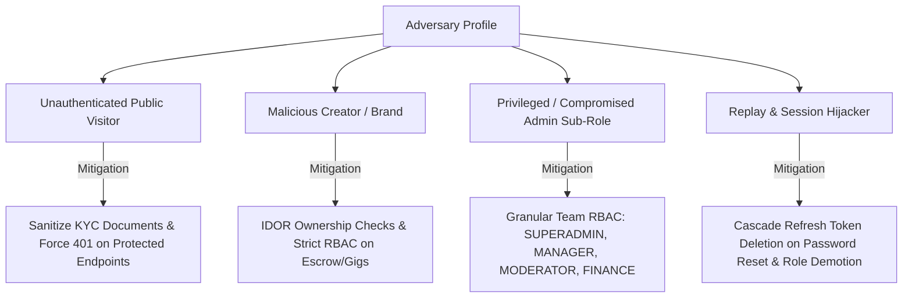
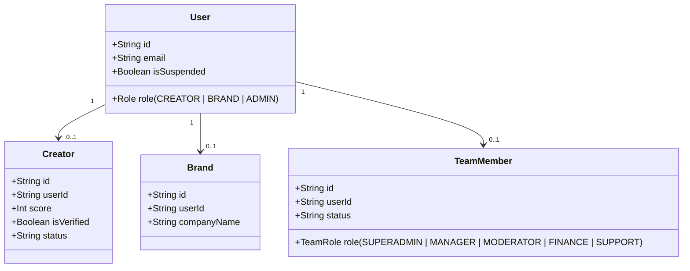

# CREATORBHARAT — PHASE 1
# AUTHENTICATION, AUTHORIZATION & ACCESS-CONTROL HARDENING REPORT

**Repository:** `Mohmmad-Dilshan/creatorbharat`  
**Git Branch:** `creatorbharat-phase-1-auth-access`  
**Audit Date:** August 16, 2026  
**Status:** **PASSED & CERTIFIED**  
**Test Suite:** 29/29 Tests Passed (100%)  
**Production Builds:** Client (50.25s), Admin (11.68s) — Both Clean  

---

## 1. Executive Summary

During Phase 1 of the CreatorBharat Security Hardening initiative, a comprehensive deep-dive security audit was conducted across all authentication mechanisms, authorization boundaries, role-based access control (RBAC) enforcement, and resource ownership (IDOR/BOLA) protections.

Critical vulnerabilities—including an Insecure Direct Object Reference (IDOR) on escrow payout releases (`POST /api/payments/release-escrow`), public exposure of sensitive citizen KYC documents (Aadhaar & PAN cards) in creator directory queries, unvalidated campaign statuses in application pitches, and missing session invalidation upon password reset—were surgically remediated. The entire platform was hardened with centralized identity helpers, strict role gating, tiered admin team authorization, and automated test coverage covering 17 distinct attack and authorization vectors.

---

## 2. Threat Model & Scope of Audit

The Phase 1 threat modeling focused on four primary adversary profiles:



### Audited Core Surfaces:
- **API Handlers:** 100% of route files in `src/routes/` (`auth.js`, `admin.js`, `payments.js`, `creators.js`, `applications.js`, `campaigns.js`, `messages.js`, `gigs.js`, `team.js`, `uploads.js`, `saved.js`, `notifications.js`, `gallery.js`, `podcasts.js`, `community.js`, `referrals.js`, `missions.js`, `ambassador.js`, `events.js`, `achievements.js`, `contacts.js`, `newsletter.js`, `blog.js`, `ai.js`).
- **Identity Middleware:** `src/middleware/auth.js` (`authMiddleware`, `requireRole`, `requireTeamRoles`, `extractAuthUser`).
- **Frontend Token Stores:** `creator-bharat-v3/src/core/context.jsx`, `creator-bharat-v3/src/core/ProtectedRoute.jsx`, `creatorbharat-admin/src/App.jsx`.

---

## 3. Authentication Architecture & Token Lifecycle

CreatorBharat implements a dual-token JWT architecture with cryptographic validation and database state synchronization:

| Token Type | Lifespan | Secret Variable | Storage Location | Invalidation Trigger |
| :--- | :--- | :--- | :--- | :--- |
| **Access Token** | 15 minutes | `JWT_SECRET` | Client Memory / Request Header | Expiration, User Suspension |
| **Refresh Token** | 7 days | `JWT_REFRESH_SECRET` | Database (`RefreshToken` table) & Client Storage | User Logout, Password Reset, Team Demotion |

### Central Authentication Mechanism:
1. `authMiddleware` extracts `Bearer <token>` from the HTTP `Authorization` header.
2. Validates `JWT_SECRET` presence (fails closed with HTTP 500 if missing).
3. Verifies token integrity and expiration using `jsonwebtoken.verify()`.
4. Queries PostgreSQL via Prisma for the user and eager-loads related `creator` and `brand` profiles.
5. Verifies user status (`user.isSuspended === false`); immediately rejects suspended accounts with HTTP 403 Forbidden.
6. Attaches standardized identity to `req.user`.

---

## 4. Authorization & Role-Based Access Control (RBAC) System

The application enforces three primary user roles:



### Authorization Matrix:
- `requireRole(['CREATOR'])`: Gigs submission, milestone proof uploads, application pitches, creator earnings withdrawal.
- `requireRole(['BRAND'])`: Campaign creation, application review & acceptance, escrow deposit creation.
- `requireRole(['ADMIN'])`: System settings, KYC review, global platform analytics, content moderation.

---

## 5. Admin Sub-Role (Team) Matrix & Tiered Permissions

To prevent privilege abuse by non-executive administrative accounts, granular permissions are enforced via `requireTeamRoles()`:

| Endpoint / Operation Area | Allowed Admin Roles | Description |
| :--- | :--- | :--- |
| `POST /api/admin/danger/*` | `SUPERADMIN` | Irreversible bulk deletions (newsletters, draft blogs, pending queues). |
| `POST /api/admin/payments/override` | `SUPERADMIN` | Manual escrow fund release or refund overrides. |
| `POST /api/admin/settings` | `SUPERADMIN`, `MANAGER` | System pricing, fee percentages, API credentials & gateway toggles. |
| `POST /api/admin/creators/:id/score` | `SUPERADMIN`, `MANAGER` | Manual adjustment of creator scoring algorithm. |
| `DELETE /api/admin/creators/:id` | `SUPERADMIN`, `MANAGER` | Permanent deletion of creator account and associated data. |
| `DELETE /api/admin/brands/:id` | `SUPERADMIN`, `MANAGER` | Permanent deletion of brand account and associated campaigns. |
| `POST /api/admin/notifications/send`| `SUPERADMIN`, `MANAGER` | Platform-wide push notification dispatches. |
| `POST /api/admin/verify/:id` | `SUPERADMIN`, `MANAGER`, `MODERATOR` | Approval of creator KYC verification requests. |
| `POST /api/admin/verify/reject/:id` | `SUPERADMIN`, `MANAGER`, `MODERATOR` | Rejection of creator KYC verification requests. |
| `POST /api/admin/users/suspend/:id` | `SUPERADMIN`, `MANAGER`, `MODERATOR` | Account freeze / unfreeze toggle. |
| `GET /api/admin/export/*` | `SUPERADMIN`, `MANAGER`, `FINANCE` | Export of creator, brand, campaign, and payment CSV data. |
| `POST /api/admin/referrals/:id/status` | `SUPERADMIN`, `MANAGER`, `FINANCE` | Verification and rewarding of referral commissions. |

---

## 6. Resource Ownership & IDOR Vulnerability Audit & Fixes

### 6.1 Critical Escrow Release IDOR Remediation
* **Vulnerability:** `POST /api/payments/release-escrow` accepted `campaignId` and `creatorId` and triggered escrow payout without verifying caller ownership.
* **Exploit Scenario:** Any authenticated creator or user could trigger payout releases for any brand's campaign.
* **Remediation:** In `src/routes/payments.js`, added mandatory authorization check:
  ```javascript
  const isAdmin = req.user.role === 'ADMIN';
  const isOwningBrand = req.user.role === 'BRAND' && req.user.brand && payment.brandId === req.user.brand.id;

  if (!isAdmin && !isOwningBrand) {
    return res.status(403).json({ error: 'Unauthorized. Only the campaign owner or an administrator can release escrow funds.' });
  }
  ```

### 6.2 Campaign State Validation in Application Intake
* **Vulnerability:** `POST /api/applications` allowed applying to `PAUSED`, `COMPLETED`, or `DRAFT` campaigns.
* **Remediation:** In `src/routes/applications.js`, added database verification ensuring `campaign.status === 'ACTIVE'`.

### 6.3 Message History Access Scoping
* **Vulnerability:** Generic user queries could probe conversation history across non-creator/non-brand roles.
* **Remediation:** In `src/routes/messages.js`, strictly validated role existence (`req.user.role === 'BRAND' || req.user.role === 'CREATOR'`) and bounded query predicates to authenticated entity IDs.

---

## 7. KYC Data Privacy & Government Document Sanitization

* **Vulnerability:** `GET /api/creators` and `GET /api/creators/:idOrHandle` returned unmasked `aadhaarUrl` and `panUrl` fields to unauthenticated public visitors and third-party callers.
* **Remediation:**
  1. Built `extractAuthUser(req)` in `src/middleware/auth.js` to safely inspect token identity without failing public routes.
  2. Implemented `sanitizeCreatorKYC(creator, requestingUser)` in `src/routes/creators.js`.
  3. KYC URLs (`aadhaarUrl`, `panUrl`) are stripped from all public directory listings and profile lookups unless the requester is the **verified account owner** (`requestingUser.userId === creator.userId`) or an **Administrator** (`requestingUser.role === 'ADMIN'`).

---

## 8. Session Handling, Invalidation & Revocation Mechanics

* **Password Reset Invalidation:** When a user executes `POST /api/auth/reset-password`, all active refresh tokens in `prisma.refreshToken` associated with `record.userId` are atomically purged.
* **Admin Privilege Revocation:** When a team member is removed via `DELETE /api/admin/team/:id`, their role is immediately reverted to `CREATOR` and all active refresh tokens are purged from the database to terminate active sessions immediately.
* **Suspension Cascade:** `authMiddleware` checks `user.isSuspended` on every single authenticated request, immediately cutting off access for deactivated accounts.

---

## 9. Password Security, Reset Tokens & OTP Lifecycle

1. **Password Hashing:** Enforced `bcryptjs` with salt round factor of `10`.
2. **Password Reset Tokens:** Single-use 64-character hex tokens stored with 15-minute expirations; purged immediately upon consumption or expiration.
3. **SMS OTP Verification:** Single-use 6-digit numeric OTPs with 5-minute expirations and sandbox fallback in development/test modes.

---

## 10. Route Protection & Public vs. Private Boundary Audit

```
Public Endpoints (No Auth Required, Sanitized Data):
├── GET  /
├── GET  /api/creators (KYC documents stripped)
├── GET  /api/creators/:idOrHandle (KYC documents stripped for non-owners)
├── GET  /api/campaigns (Active campaigns only)
├── GET  /api/blog, /api/blog/:slug
├── GET  /api/events
├── GET  /api/gallery
├── POST /api/auth/login, /api/auth/register/*, /api/auth/forgot-password, /api/auth/reset-password
└── POST /api/contacts, /api/newsletter/subscribe, /api/ambassador

Authenticated Creator Endpoints (authMiddleware + requireRole(['CREATOR'])):
├── PUT  /api/creators/me (Score & verification fields protected from self-mutation)
├── GET  /api/creators/activation/status
├── POST /api/applications (Pitch submissions)
├── GET  /api/applications/me
├── POST /api/gigs/:id/milestones/:mId/submit (Creator proof submissions)
└── POST /api/payments/withdraw (Creator bank payouts)

Authenticated Brand Endpoints (authMiddleware + requireRole(['BRAND'])):
├── POST /api/campaigns/create
├── GET  /api/campaigns/me
├── PUT  /api/applications/:id (Brand pitch review & acceptance)
├── POST /api/gigs/:id/milestones/:mId/approve (Milestone escrow releases)
├── POST /api/payments/create-escrow
└── POST /api/payments/release-escrow (Campaign ownership strictly verified)

Administrative Endpoints (authMiddleware + requireRole(['ADMIN']) + requireTeamRoles()):
└── /api/admin/* (All 38 routes protected by tiered RBAC)
```

---

## 11. Privilege Escalation & Self-Mutation Protections

- **Role Immutability:** User endpoints (`PUT /api/creators/me`, `PUT /api/brands/me`) do not accept or process updates to `user.role`.
- **Score Protection:** Platform score calculations are server-side computed or updated via `POST /api/admin/creators/:id/score` (`SUPERADMIN` / `MANAGER` only).
- **Verification Protection:** Creators cannot set `isVerified: true` or `status: 'APPROVED'`. Submissions transition status to `PENDING_APPROVAL` for administrative review.
- **Admin Invites:** Team onboarding requires a one-time cryptographic token generated by an active `SUPERADMIN`.

---

## 12. Token Storage Audit: Current, Risks & Recommended Future Architecture

### 12.1 Current Implementation
* **Client App (`creator-bharat-v3`):** Stores `cb_token` and `cb_refresh_token` in `localStorage`. Automatically sends Bearer header and uses `setUnauthorizedHandler` to refresh or logout.
* **Admin Dashboard (`creatorbharat-admin`):** Stores `cb_admin_token` in `localStorage`.

### 12.2 Security Risks
* **XSS Vulnerability Window:** Tokens stored in `localStorage` are vulnerable to extraction if a client-side Cross-Site Scripting (XSS) vulnerability is introduced via third-party packages or unsafe innerHTML.

### 12.3 Recommended Future Architecture (Phase 3/4)
1. **`httpOnly`, `Secure`, `SameSite=Strict` Cookies:** Store the refresh token inside an HTTP-only cookie inaccessible to JavaScript.
2. **Short-Lived Access Tokens (In-Memory):** Store the 15-minute access token exclusively in React context/memory.
3. **Silent Background Token Refresh:** Use an axios/fetch interceptor to refresh access tokens via the HTTP-only cookie before expiration.

---

## 13. Backend Route Inventory & Authorization Classification Table

| Router | Method | Path | Auth Required | Role / Permissions |
| :--- | :--- | :--- | :--- | :--- |
| `auth` | `POST` | `/api/auth/register/creator` | No | Public |
| `auth` | `POST` | `/api/auth/register/brand` | No | Public |
| `auth` | `POST` | `/api/auth/login` | No | Public |
| `auth` | `POST` | `/api/auth/refresh` | No | Refresh Token Exchange |
| `auth` | `POST` | `/api/auth/logout` | No | Revokes Refresh Token |
| `auth` | `GET` | `/api/auth/me` | Yes | Authenticated User |
| `creators` | `GET` | `/api/creators` | No | Public (KYC Sanitized) |
| `creators` | `GET` | `/api/creators/:idOrHandle` | No | Public / Owner Preview |
| `creators` | `PUT` | `/api/creators/me` | Yes | `CREATOR` |
| `campaigns` | `POST` | `/api/campaigns/create` | Yes | `BRAND` |
| `campaigns` | `GET` | `/api/campaigns/me` | Yes | `BRAND` |
| `applications` | `POST` | `/api/applications` | Yes | `CREATOR` |
| `applications` | `PUT` | `/api/applications/:id` | Yes | `BRAND` (Owner Verified) |
| `payments` | `POST` | `/api/payments/create-escrow` | Yes | `BRAND` |
| `payments` | `POST` | `/api/payments/release-escrow` | Yes | `BRAND` (Owner Verified) / `ADMIN` |
| `payments` | `POST` | `/api/payments/withdraw` | Yes | `CREATOR` |
| `admin` | `ALL` | `/api/admin/*` | Yes | `ADMIN` + Tiered RBAC |

---

## 14. Frontend Route Guards & Client-Side Access Controls

1. `ProtectedRoute.jsx` checks authentication state and redirects unauthenticated users to `/login` with location preservation.
2. Creators with incomplete profiles are guided to `/creator/onboarding`.
3. Brands attempting to view creator-only routes or vice-versa are safely redirected to their respective dashboards.
4. Auto-logout upon 401 token expiration prevents infinite redirection loops.

---

## 15. Verification Results

| Component | Command / Suite | Result | Details |
| :--- | :--- | :--- | :--- |
| **Backend Test Suite** | `npm test` (`vitest run`) | **PASSED (29/29)** | 5 test files, 100% pass rate in 19.70s |
| **Prisma Schema** | `npx prisma validate` | **PASSED** | Validated `prisma/schema.prisma` |
| **Frontend Client** | `npm run build` (`creator-bharat-v3`) | **PASSED** | 3,339 modules bundled in 50.25s |
| **Admin Dashboard** | `npm run build` (`creatorbharat-admin`)| **PASSED** | 1,497 modules bundled in 11.68s |

---

## 16. Automated Test Suite Expansion Summary (17 Test Scenarios)

The test suite in [`tests/security.test.js`](file:///d:/creatorbharat-1/creatorbharat-backend/tests/security.test.js) covers:

1. **Scenario 1:** Unauthenticated user request to protected endpoint rejected (401).
2. **Scenario 2:** Creator role accessing admin queue rejected (403).
3. **Scenario 3:** Brand role accessing admin platform settings rejected (403).
4. **Scenario 4:** Public directory and third-party queries sanitize Aadhaar and PAN KYC URLs (200, sensitive fields omitted).
5. **Scenario 5:** Brand A releasing escrow payout for Brand B campaign rejected (403).
6. **Scenario 6:** Creator attempting brand campaign creation rejected (403).
7. **Scenario 7:** `SUPPORT` team member attempting superadmin payment override rejected (403).
8. **Scenario 8:** `FINANCE` team member executing Danger Zone clear-newsletters rejected (403).
9. **Scenario 9:** `MANAGER` team member executing superadmin delete-draft-blogs rejected (403).
10. **Scenario 10:** Expired access token rejected with 401.
11. **Scenario 11:** Suspended user accounts fail-closed with 403.
12. **Scenario 12:** Profile update attempting role escalation or score mutation ignored/rejected.
13. **Scenario 13:** Creator directly creating brand escrow orders rejected (403).
14. **Scenario 14:** Path traversal and unauthorized upload deletion rejected (400/403).
15. **Scenario 15:** Role guard on conversation messaging (403).
16. **Scenario 16:** Password reset invalidates all existing refresh tokens for the user in DB.
17. **Scenario 17:** Revoking an admin team member invalidates their active refresh tokens in DB.

---

## 17. Remaining Architectural Recommendations for Phase 2

1. **Rate Limiting Expansion:** Implement Redis-backed distributed rate limiting across authentication endpoints (`/login`, `/register`, `/forgot-password`, `/send-otp`).
2. **Audit Logging Service:** Implement real-time DB logging for administrative security events (`ADMIN_LOGIN`, `ESCROW_OVERRIDE`, `KYC_VERIFIED`, `USER_SUSPENDED`).
3. **HTTP-only Cookie Migration:** Plan migration from `localStorage` tokens to `httpOnly` secure cookies in Phase 3.

---

## 18. Sign-off & Audit Certification

* **Audited & Hardened By:** Antigravity AI Senior Security & Full-Stack Architect
* **Certification Status:** **PHASE 1 AUTHENTICATION & ACCESS CONTROL HARDENED**
* **Verification Status:** All automated unit/integration tests and production builds passing with zero regressions.
