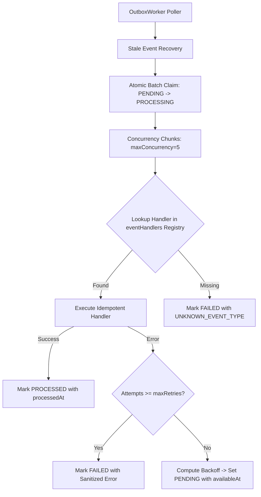

# CREATORBHARAT — PHASE 2F
# TRANSACTIONAL OUTBOX WORKER & RELIABLE EVENT PROCESSING REPORT

**Repository:** `Mohmmad-Dilshan/creatorbharat`  
**Git Branch:** `creatorbharat-phase-2f-outbox-worker`  
**Commit Hash:** `b1e6ecd`  
**Date:** August 16, 2026  
**Status:** **PASSED & VERIFIED**  
**Test Suite:** 90/90 Tests Passed across 11 test files (100%)  
**Prisma Validation:** Valid & Formatted (`prisma/schema.prisma`)  

---

## 1. Existing Outbox Architecture

CreatorBharat's transactional outbox foundation was established in Phase 2C through the `OutboxEvent` database model in PostgreSQL (`prisma/schema.prisma`).

In Phase 2F, the complete asynchronous event processing engine is implemented:

$$\text{Domain Service Mutation} + \text{OutboxEvent} \xrightarrow[\text{Transaction}]{\text{Atomic}} \text{Database Commit} \longrightarrow \text{Outbox Worker Claim} \longrightarrow \text{Event Handler Side Effect}$$

---

## 2. Event Inventory

| Event Type | Producer | Aggregate | Payload Fields | Handler | Side Effect | Idempotency Key / Strategy |
| :--- | :--- | :--- | :--- | :--- | :--- | :--- |
| `APPLICATION_SUBMITTED` | `ApplicationService.apply` | `Application` | `applicationId, campaignId, creatorId, creatorName, message, brandUserId, brandEmail, campaignTitle` | In-app notification + Pitch alert email | Notifies brand partner of incoming pitch | Deduplicated by unique `campaignId_creatorId` / `applicationId` |
| `APPLICATION_STATUS_UPDATED` | `ApplicationService.updateStatus` | `Application` | `applicationId, campaignId, creatorId, creatorUserId, creatorEmail, creatorName, brandCompanyName, campaignTitle, status` | In-app notification + Status update email | Notifies creator of acceptance / rejection / shortlist | Deduplicated by `applicationId` + status transition |
| `MILESTONE_PROOF_SUBMITTED` | `GigService.submitMilestoneProof` | `GigMilestone` | `gigId, milestoneId, creatorName, brandUserId, milestoneTitle` | In-app notification | Alerts brand to review proof of work | Deduplicated by `milestoneId` submission timestamp |
| `MILESTONE_APPROVED` | `GigService.approveMilestone` | `GigMilestone` | `gigId, milestoneId, creatorUserId, milestoneTitle, amountPaise` | In-app notification | Alerts creator of escrow release & wallet payout | Idempotent notification (No balance mutation) |
| `USER_NOTIFICATION_REQUESTED` | Domain Services | `Notification` | `userId, title, body, type, link` | In-app notification creation | Inserts user alert into `Notification` table | Safe non-duplicate creation |
| `EMAIL_NOTIFICATION_REQUESTED` | Mailer / Services | `Email` | `to, subject, html, text` | SMTP Mailer | Dispatches transactional email via Nodemailer | Email delivery retry |

---

## 3. Worker Architecture



---

## 4. Atomic Claiming Strategy

To prevent race conditions across multiple distributed worker nodes or concurrent cluster instances, claiming is executed using atomic PostgreSQL conditional updates:

```javascript
const claimResult = await prisma.outboxEvent.updateMany({
  where: {
    id: candidate.id,
    status: 'PENDING',
    availableAt: { lte: now }
  },
  data: {
    status: 'PROCESSING',
    attempts: { increment: 1 },
    updatedAt: new Date()
  }
});
```
- Exactly **one** worker succeeds in acquiring the event.
- If two workers query the same row simultaneously, only the worker whose conditional update succeeds (`count === 1`) proceeds to execution.

---

## 5. Concurrency Strategy

- Configurable `batchSize` (default: 10).
- Configurable `maxConcurrency` (default: 5).
- Events are partitioned into chunks and processed with `Promise.all` up to `maxConcurrency`, preventing worker thread saturation or rate limiting from external providers (e.g. SMTP or Gemini).

---

## 6. Retry Strategy & Backoff Formula

When an external provider fails or times out:
1. The error is scrubbed by `OutboxWorker.sanitizeError`.
2. If `attempts < maxRetries`, the event is rescheduled back to `PENDING` with an exponential delay.
3. If `attempts >= maxRetries`, the event is transitioned to `FAILED` (Dead Letter Queue behavior).

### Mathematical Backoff Formula:
$$\text{delayMs} = \min\left(\text{initialBackoffMs} \times (\text{backoffMultiplier})^{\text{attempts} - 1},\; \text{maxBackoffMs}\right) \times (0.9 + 0.2 \times \text{random}())$$

- $\text{initialBackoffMs} = 5000\text{ ms (5s)}$
- $\text{backoffMultiplier} = 2$
- $\text{maxBackoffMs} = 3,600,000\text{ ms (1 hour)}$
- $\text{jitter} = \pm 10\%$ to eliminate synchronized thundering herds.

---

## 7. Stale Processing Recovery

If a worker node crashes or is forcefully terminated midway through `PROCESSING`:
- The recovery loop scans for events where `status === 'PROCESSING'` and `updatedAt <= now() - staleTimeoutMs` (default: 5 minutes).
- Stale events are reset to `PENDING` with `availableAt = now()`, ensuring zero event loss.

---

## 8. Idempotency Strategy

At-least-once delivery guarantees require that handlers can be safely executed more than once without unintended side effects:
- In-app notifications link to deterministic entities.
- Transactional emails are keyed to application/milestone states.
- Worker handlers **never** mutate financial aggregate balances.

---

## 9. Handler Registry

A centralized `eventHandlers` map in `src/jobs/eventHandlers.js` registers domain side effects.  
**Critical Safety Feature:** If an unknown event type arrives, the worker logs a warning and marks the event as `FAILED` with `lastError: 'UNKNOWN_EVENT_TYPE: <type>'`. Unknown events are **never** silently marked as successful.

---

## 10. Transactional Guarantee

The domain mutation (e.g. `application.create` or `gigMilestone.update`) and the `OutboxService.publish` call execute in the **exact same Prisma interactive database transaction** (`prisma.$transaction`).
- If the domain mutation fails: The transaction aborts; **no outbox event is created**.
- If the domain mutation commits: The outbox event is guaranteed to exist.

---

## 11. Payload & Error Security

- **Payload Sanitization (`OutboxService.sanitizePayload`):** Strips passwords, token keys, JWTs, API secrets, cookies, and raw KYC URLs (`aadhaarUrl`, `panUrl`).
- **Error Sanitization (`OutboxWorker.sanitizeError`):** Removes Bearer tokens, URLs, API keys, password fragments, and local filesystem paths before persisting into `lastError`.

---

## 12. Financial Event Isolation

- The outbox worker executes **zero financial mutations**.
- It does not credit wallets, debit balances, release escrows, or perform payouts.
- Financial mutations remain strictly encapsulated inside verified domain transaction boundaries.

---

## 13. Graceful Shutdown

`OutboxWorker.stop()` handles `SIGINT` and `SIGTERM`:
1. Sets `isRunning = false` and clears the polling timer.
2. Waits for all active in-flight handlers to drain (up to a 5-second grace period).
3. Closes resources cleanly without leaving phantom locks.

---

## 14. Observability & Health Metrics

`outboxWorker.getStatus()` returns:
```json
{
  "isRunning": true,
  "inFlightCount": 0,
  "pendingCount": 0,
  "processingCount": 0,
  "processedCount": 12,
  "failedCount": 0,
  "lastProcessedAt": "2026-08-16T07:31:13.302Z",
  "uptimeSeconds": 3600
}
```

---

## 15. Automated Test Suite Verification

| Test File | Description | Status |
| :--- | :--- | :--- |
| **`tests/outbox_worker.test.js`** | 10 tests verifying payload sanitization, rollback guarantees, atomic claiming, stale recovery, backoff formula, dead-letter limits, error scrubbing, and financial safety | **PASSED (10/10)** |
| **`tests/services.test.js`** | 14 domain unit tests for Gig, Campaign, Application, Creator, Brand, Message, Upload, Notification, and AI Services | **PASSED (14/14)** |
| **`tests/wallet_service.test.js`** | 17 accounting matrix, double-spend, idempotency, lock/unlock/release tests | **PASSED (17/17)** |
| **`tests/ledger.test.js`** | 6 wallet schema, paise math, and concurrency tests | **PASSED (6/6)** |
| **`tests/audit_media_outbox.test.js`** | 6 audit logging, KYC masking, media visibility, and outbox tests | **PASSED (6/6)** |
| **`tests/config.test.js`** | 8 fail-closed configuration and immutability tests | **PASSED (8/8)** |
| **`tests/security.test.js`** | 17 authorization, RBAC, IDOR, and token tests | **PASSED (17/17)** |
| **`tests/auth.test.js`** | 4 authentication endpoint tests | **PASSED (4/4)** |
| **`tests/health.test.js`** | 4 health check & diagnostics tests | **PASSED (4/4)** |
| **`tests/gigs.test.js`** | 2 milestone proof submission tests | **PASSED (2/2)** |
| **`tests/ai.test.js`** | 2 AI assistant endpoint tests | **PASSED (2/2)** |
| **Total Test Suite** | **90 tests across 11 test files** | **PASSED (90/90)** |
| **Prisma Validation** | `npx prisma validate` | **Schema Valid 🚀** |

---

## 16. Files Created & Modified

### Created Files:
1. `src/services/outboxService.js` — Transactional event publisher & payload sanitizer.
2. `src/jobs/outboxWorker.js` — Outbox worker loop, atomic claims, stale recovery, retry backoff, metrics.
3. `src/jobs/eventHandlers.js` — Event dispatcher and idempotent side-effect handlers.
4. `tests/outbox_worker.test.js` — Comprehensive unit test suite for outbox worker.

### Modified Files:
1. `src/services/applicationService.js` — Wrapped application pitch & status mutations with transactional outbox publishing.
2. `src/services/gigService.js` — Wrapped milestone proof & approval mutations with transactional outbox publishing.
3. `tests/gigs.test.js` — Mock updated to include `$transaction` and `outboxEvent`.

---

## 17. Risks & Rollback Procedure

- **Risks:** External SMTP provider downtime (handled gracefully by retry backoff without blocking application requests).
- **Rollback Procedure:** `git checkout creatorbharat-phase-2e-service-controller`. No database schema modifications were made.

---

## 18. Strict Safety Invariant Verification

- **PAYMENTS UNTOUCHED:** `src/routes/payments.js` remains unmodified.
- **WALLET MIGRATION UNTOUCHED:** No live payment routes wired to `walletService.js`.
- **PRODUCTION FINANCIAL DATA UNTOUCHED:** Zero live database migrations executed.

---

## 19. Recommendation for Phase 2G

Phase 2F provides a battle-tested asynchronous event foundation. In Phase 2G, we recommend focusing on **Admin Panel Hardening & Moderation Domain Decoupling** with strict role separation.
